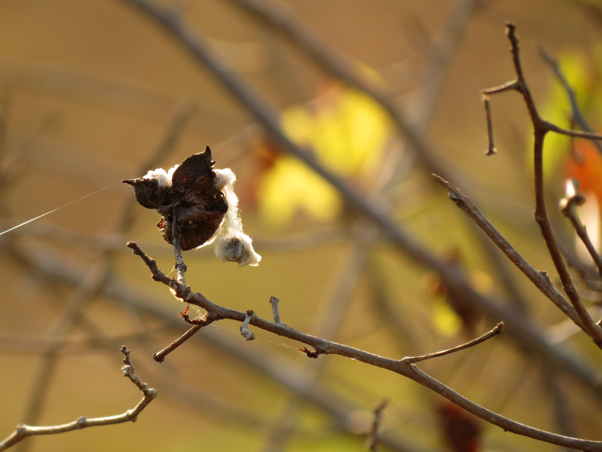
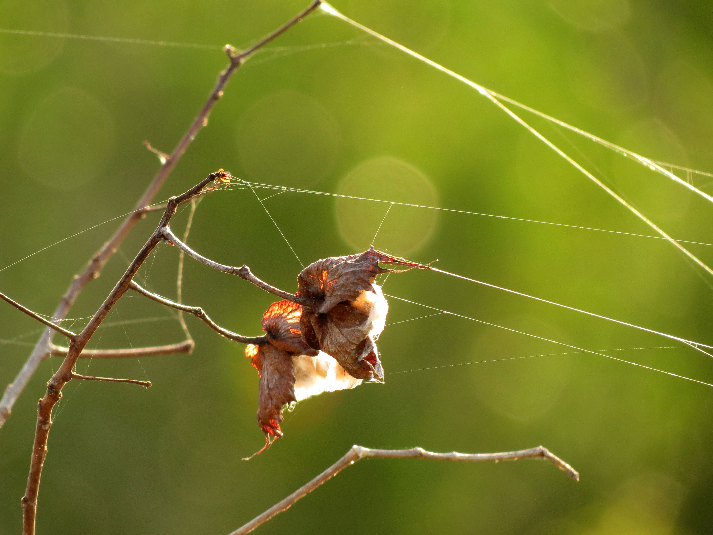
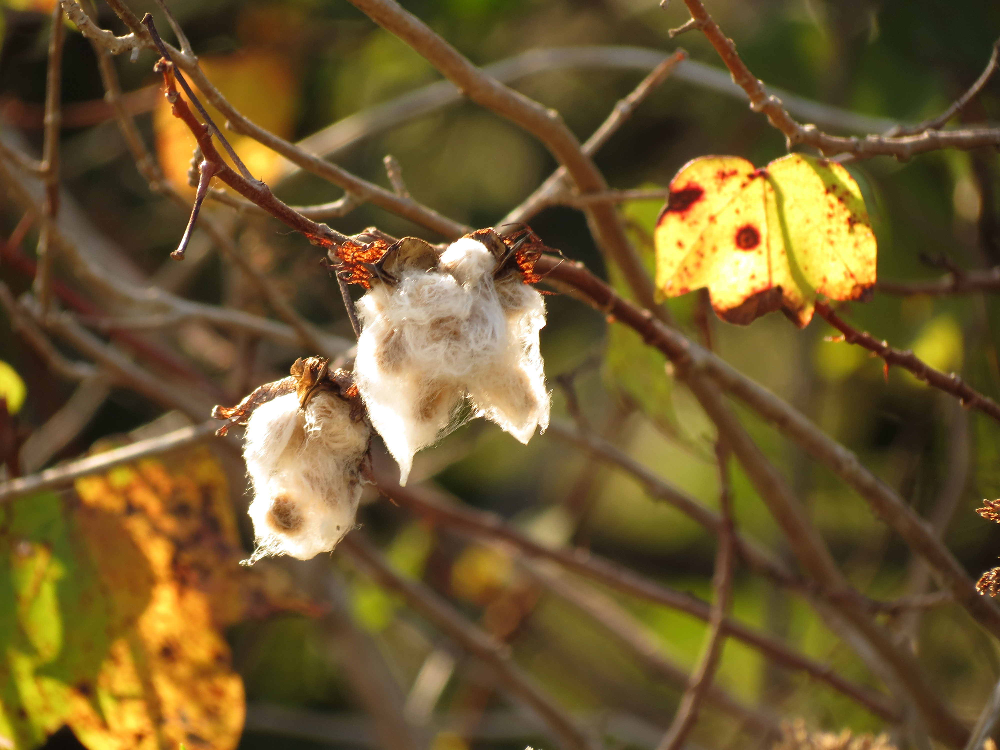
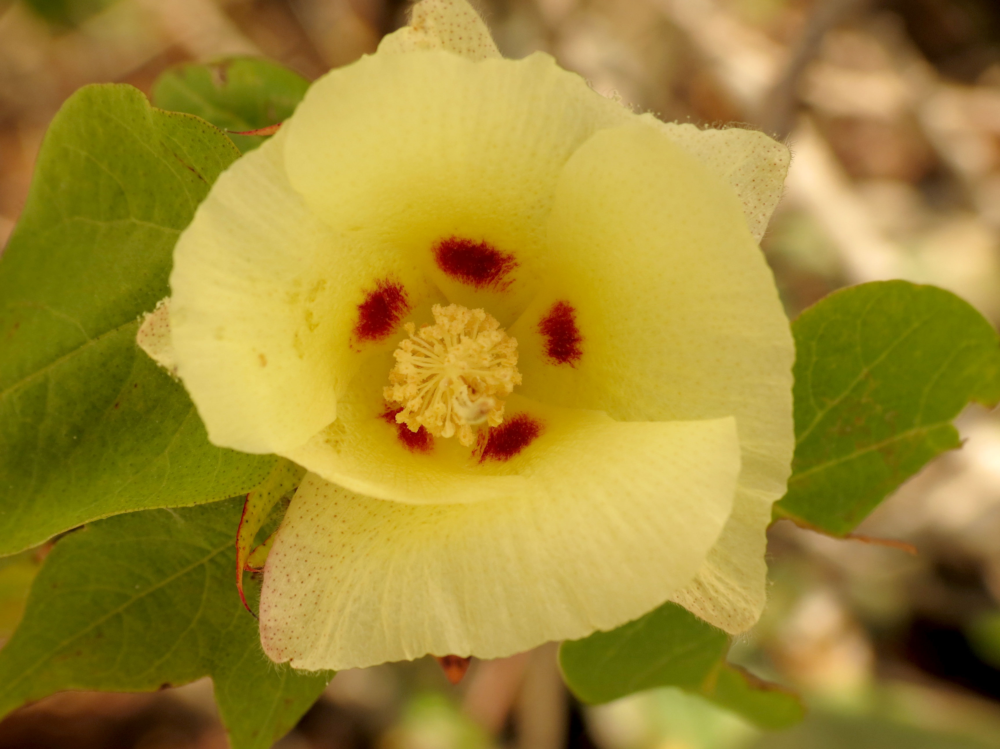
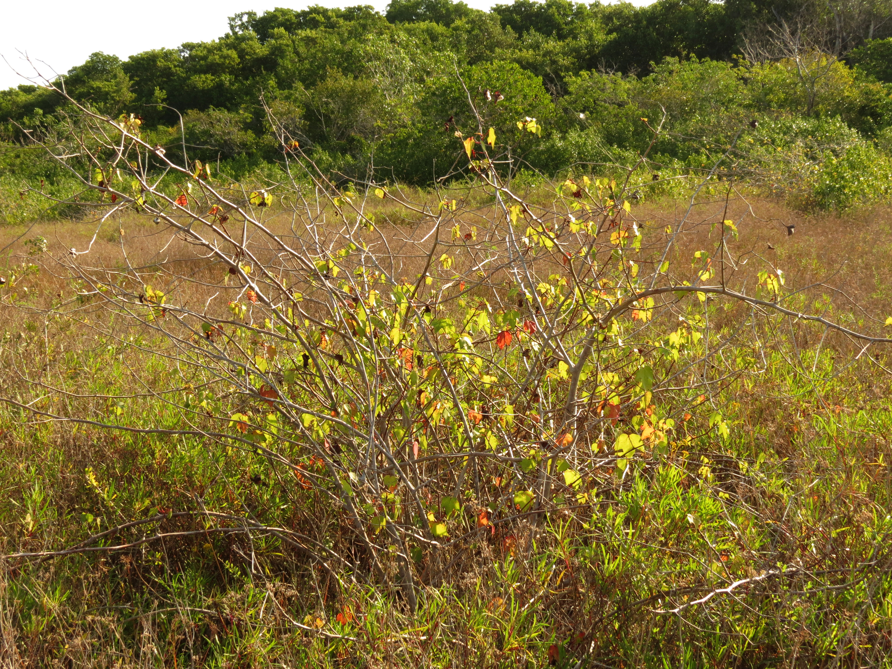
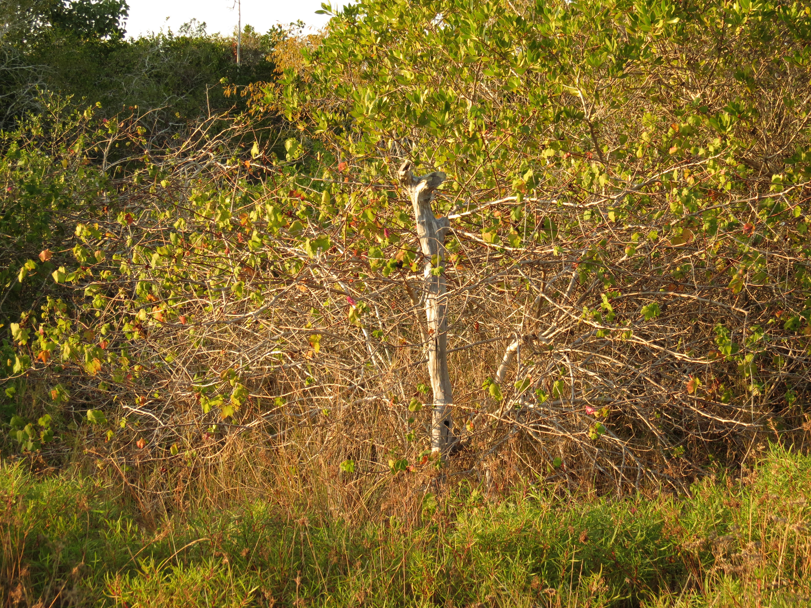

# Population genomic diversity and the domestication history of wild cotton (*Gossypium hirsutum*)

  
   
   
   
   
   

Top: Field photot of Yucatán wild cottons;  
Photo resource: iNaturalist https://www.inaturalist.org/people/treegrow 

#
### Abstract 
*Gossypium hirsutum* is the leading fiber crop globally, but its origin as a domesticated plant and patterns of diversity in the wild remain to be elucidated. Here we use extensive sampling of wild populations and comparative genome sequence data to illuminate the scope and patterning of wild cotton diversity across its native range. Analyses confirm the long-standing hypothesis that the Yucatán Peninsula (México) is the center of domestication, from which the original perennial forms and later modern annualized cultivars were derived. Population structure and phylogenomic analyses indicate that the center of domestication is in northwestern Yucatán, which harbors greater genetic diversity relative to smaller, geographically dispersed populations in northeastern Yucatán and the Caribbean basin. Genetic load and transposable element burden also are lowest in the Yucatán relative to other regions, consistent with its greater diversity and reflecting the effects of historical genetic bottlenecks in other populations. Florida maintains its own unique pockets of genetic diversity, as do other dispersed populations in the Caribbean basin, which have experienced repeated cycles of colonization and extinction, as well as introgression from the related G. barbadense. Our study quantifies the scope and scale of genomic diversity in wild cotton, the origin of the cultivated gene pool, and the likely ecological and anthropogenic processes that shaped extant diversity and modern geographic patterning. 

#### Manuscript link: to be updated

#
#### [00_RefGenomeTEX2094](https://github.com/Wendellab/Wildcotton_YUCFL/tree/main/00_RefGenomeTEX2094)
Reference genome assembly and annotation (TE/gene) for TEX2094.

#### [01_MajorGeneticGroups](https://github.com/Wendellab/Wildcotton_YUCFL/tree/main/01_MajorGeneticGroups)
Analysis of major genetic groups.

#### [02_RelationshipsBetweenWildCotton](https://github.com/Wendellab/Wildcotton_YUCFL/tree/main/02_RelationshipsBetweenWildCotton)
Phylogenetic and population relationship analyses among wild cotton species.

#### [03_GenomicDiversityComparisonbetweenWildCottons](https://github.com/Wendellab/Wildcotton_YUCFL/tree/main/03_GenomicDiversityComparisonbetweenWildCottons)
Comparative analyses of genomic diversity across wild cotton populations.

#### [04_GeneticStructurewithinYUCFL](https://github.com/Wendellab/Wildcotton_YUCFL/tree/main/04_%20GeneticStructurewithinYUCFL)
Population structure analyses within YUC and FL populations.

#### [05_WildCottonTEandGeneticload](https://github.com/Wendellab/Wildcotton_YUCFL/tree/main/05_WildCottonTEandGeneticload)
Transposable element profiling and genetic load estimation in wild cottons.

#### [06_SelectionScan](https://github.com/Wendellab/Wildcotton_YUCFL/tree/main/06_SelectionScan)
Genome-wide selection scan analyses.

